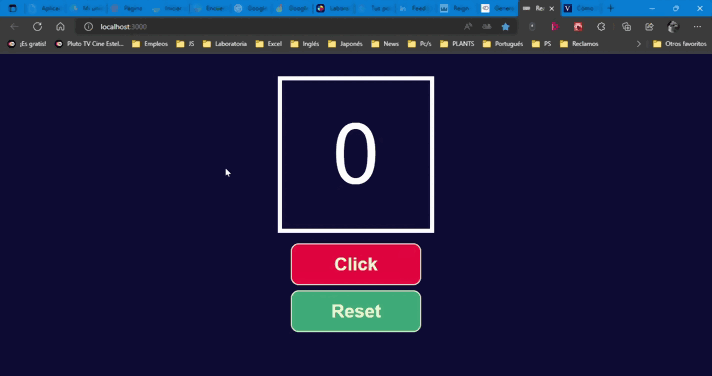

# React counter
Es un aplicativo responsivo de un contador sencillo realizado en React practicando los fundamentos básicos en este popular framework. Solo basta dar clic al botón "Click" para que el contador vaya incrementando de uno en uno y si deseas reiniciar a 0, tendrás que dar clickear en el botón "Reset".

